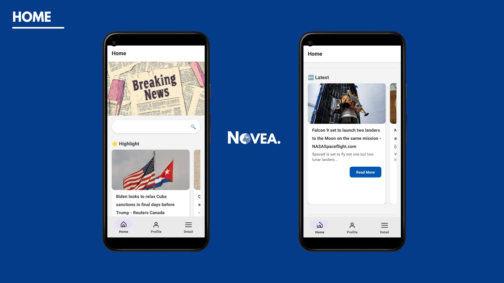
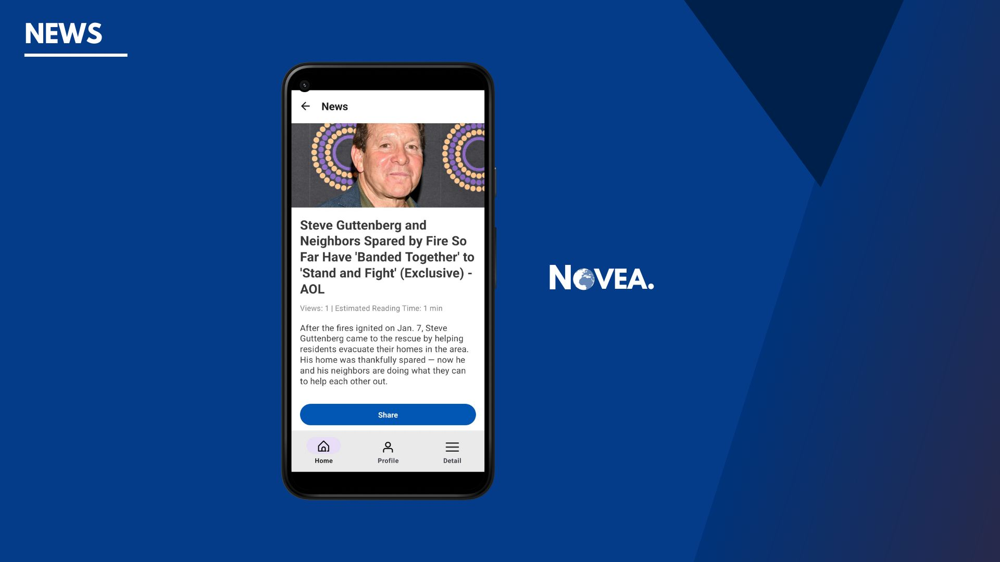
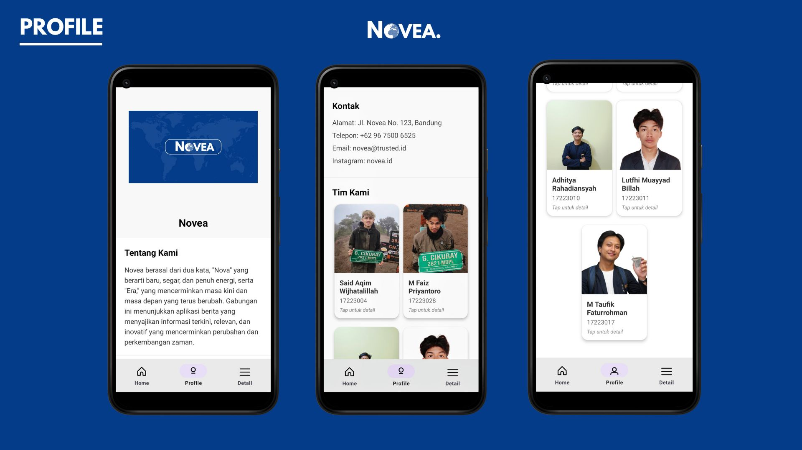
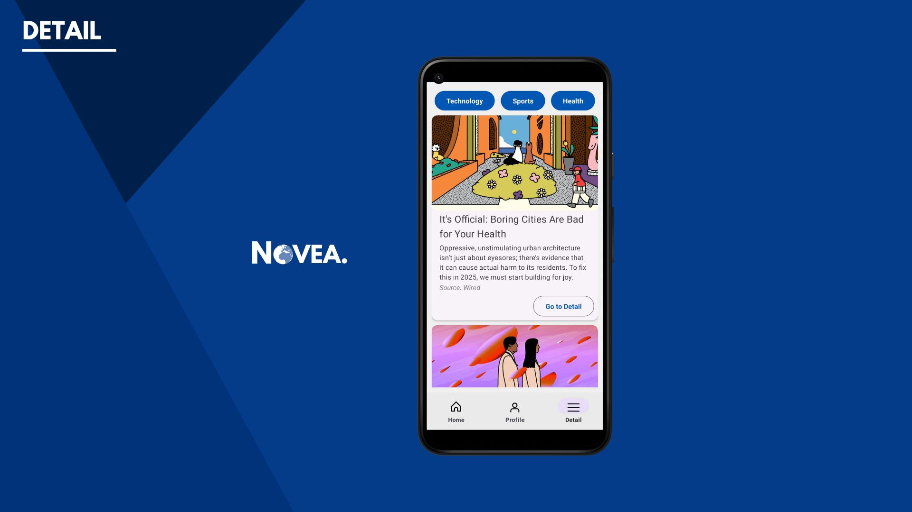

# Kelompok Aplikasi Novea TI.5A
1. M Faiz Priyantoro - 17223028
2. Said Aqim Wijhatalillah - 17223004
3. Adhitya Rahadiansyah - 17221014
4. Lutfhi Muayyad Billah - 17223011
5. M Taufik Faturrohman - 17223017

# Deskripsi
Aplikasi berita online yang dibangun menggunakan React Native. Aplikasi ini memungkinkan pengguna untuk melihat berita terkini, membaca detail berita, dan berbagi berita melalui media sosial. Novea berasal dari dua kata, "Nova" yang berarti baru, segar, dan penuh energi, serta "Era," yang mencerminkan masa kini dan masa depan yang terus berubah. Gabungan ini menunjukkan aplikasi berita yang menyajikan informasi terkini, relevan, dan inovatif yang mencerminkan perubahan dan perkembangan zaman.

# Fitur Utama
1. Navigasi: Pengguna dapat berpindah antar halaman dengan mudah menggunakan bottom-navigation.
2. Pencarian Berita: Pengguna dapat mencari berita berdasarkan judul.
3. Detail Berita: Pengguna dapat melihat detail berita dan membagikannya.
4. Kategorisasi Berita: Pengguna dapat melihat berita berdasarkan kategori tertentu.

# Struktur Halaman

1. Mengambil data berita dari News API menggunakan fetch.
2. Menyimpan data berita dalam state dan menampilkan berita dalam format kartu.
3. Menyediakan fitur pencarian untuk memfilter berita berdasarkan judul.

***

1. Menampilkan detail berita yang dipilih dari halaman Home.
2. Menghitung jumlah tampilan dan estimasi waktu baca berdasarkan jumlah kata dalam deskripsi.
3. Menyediakan fitur untuk membagikan berita melalui media sosial.

***

1. Menampilkan informasi aplikasi (nama, deskripsi, kontak, logo).
2. Daftar anggota tim dengan kartu profil masing-masing.
3. Modal popup interaktif untuk menampilkan detail anggota tim.

***

1. Mengambil berita berdasarkan kategori yang dipilih (misalnya, teknologi, olahraga, kesehatan).
2. Menampilkan daftar artikel yang diambil berdasarkan kategori yang dipilih.
3. Menggunakan FlatList untuk menampilkan daftar artikel dengan efisien.

---

### Jurusan
**Teknik Informatika**  

### Fakultas
**Fakultas Teknologi Informasi**  

### Universitas
**Universitas Adhirajasa Reswara Sanjaya**
